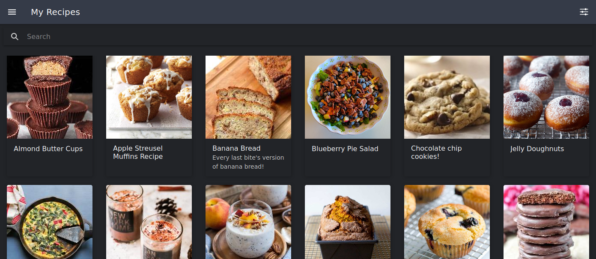
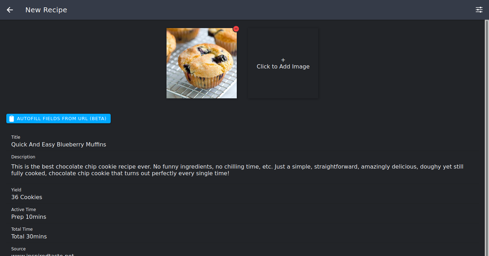
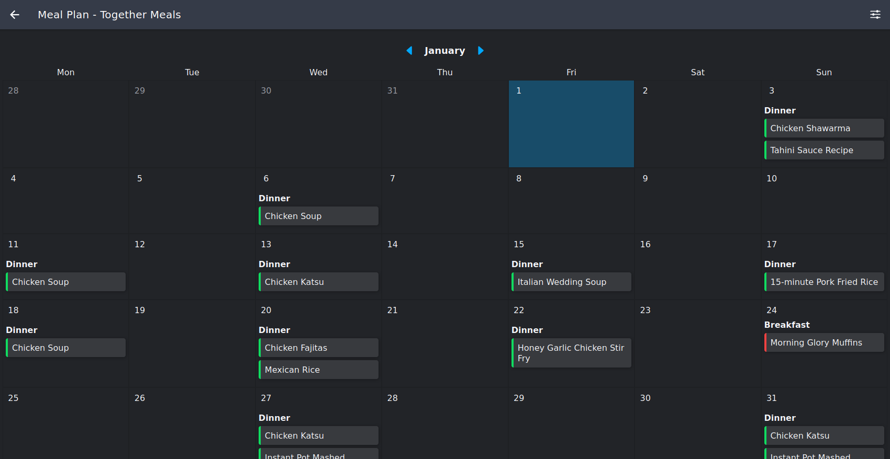

</img>

# RecipeSage - A Collaborative Recipe Keeper, Meal Planner, and Shopping List Organizer

Share and collaborate on recipes, manage household shopping lists and meal planning, and import recipes from anywhere on the web instantly.

# Features

</img>

Web-based PWA that functions like a native app on mobile.
  

</img>

Import recipes from any website out there *(see [RecipeClipper](https://github.com/julianpoy/recipeclipper) for more info on how it does this)*.
  

</img>

Organize your meal plans & shopping lists, with draggable items and automatic categorization.
  

# License

RecipeSage is dual-licensed.

For all **non-commercial usage**, RecipeSage is available for use under the terms of the [AGPL license](https://www.gnu.org/licenses/agpl-3.0.en.html)*.

For all **commercial usage**, RecipeSage is available for proprietary licensing upon request. You may contact me at julian@recipesage.com to request a license.
Pricing for commercial licenses will depend on usage, and any associated fees are intended to support the project and community as a whole.

# CLA
Contributor license agreement.

When contributing or suggesting code for RecipeSage, you irrevocably grant RecipeSage all rights to that code. See the CLA file in the repo for the complete CLA.
